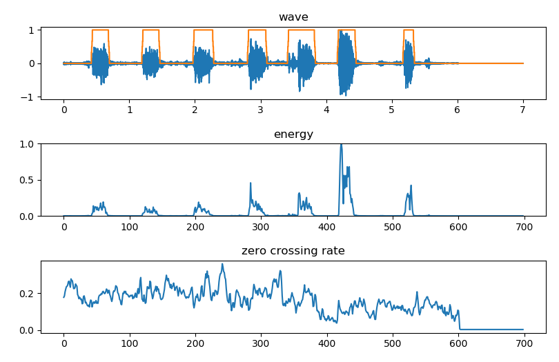

## 算法简述

整个端点检测过程分为三步

* 使用较高的短时能量阈值 MH 检测得到能量大于 MH 的帧
* 使用较低的短时能量阈值 ML 检测得到能量大于 ML 的帧
* 使用过零率阈值 Zs 检测得到能量过零率大于 3*Zs 的帧

当信噪比较大（pure/snr_10/snr_5）时，

* MH 等于总能量均值的 1/2
* ML 等于后五帧能量均值与 MH 之和的1/2
* Zs 等于前五帧过零率均值

当信噪比较小（snr_0/snr_-5/snr_-10）时，

* MH 等于总能量均值

[算法详细介绍](https://blog.csdn.net/rocketeerLi/article/details/83307435)

[参考项目](https://github.com/rocketeerli/Computer-VisionandAudio-Lab/tree/master/lab1)

## 使用说明

运行 `python energy_ZRC_VAD` 选择不同信噪比的测试集，对算法进行评估

运行 `python test.py` 对单个样本进行检测

下图为 `test.wav` 文件的检测结果，`test.json` 为样本的标签

