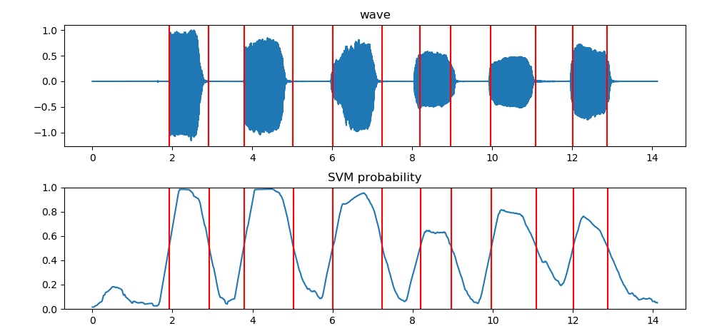

## 算法简述

* 特征提取：特征向量的 `shape=(68,966)` (特征数, 帧数)
* 训练模型：通过短时能量将部分帧分为两类，作为样本训练SVM
* 端点检测：对SVM输出的概率曲线进行处理，得到检测结果

[参考项目](https://github.com/tyiannak/pyAudioAnalysis)

## 使用说明

直接 `python SVM_VAD.py` 即可

下图为 `test.wav` 文件的检测结果

## TODO

- [ ] 将切分好的音频段保存为wav文件