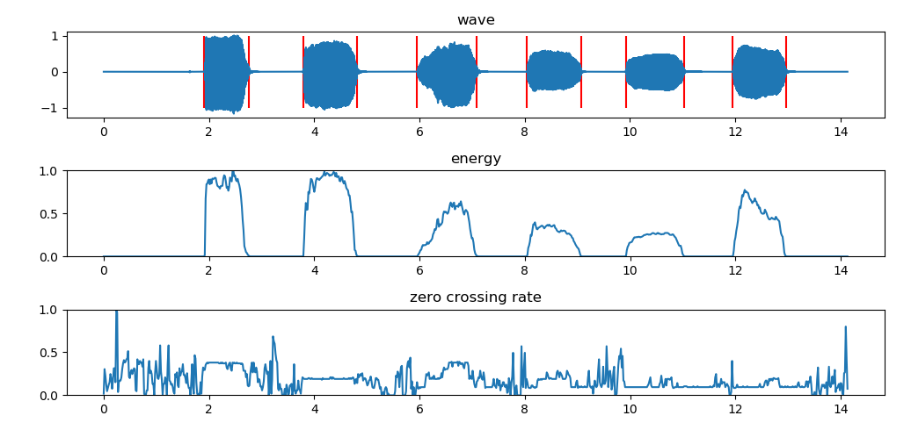

## 算法简述

整个端点检测过程分为三步

* 使用较高的短时能量阈值 MH 检测得到能量大于 MH 的帧
* 使用较低的短时能量阈值 ML 检测得到能量大于 ML 的帧
* 使用过零率阈值 Zs 检测得到能量过零率大于 3*Zs 的帧

其中

* MH 等于总能量均值的1/4
* ML 等于前五帧能量均值与总能量均值之和的1/4
* Zs 等于前五帧过零率均值

**阈值可以修改**

[算法详细介绍](https://blog.csdn.net/rocketeerLi/article/details/83307435)

[参考项目](https://github.com/rocketeerli/Computer-VisionandAudio-Lab/tree/master/lab1)

## 使用说明

直接 `python energy_ZRC_VAD.py` 即可

本项目仅对参考项目的结果进行了可视化

下图为 `test.wav` 文件的检测结果

## TODO

- [ ] 将切分好的音频段保存为wav文件